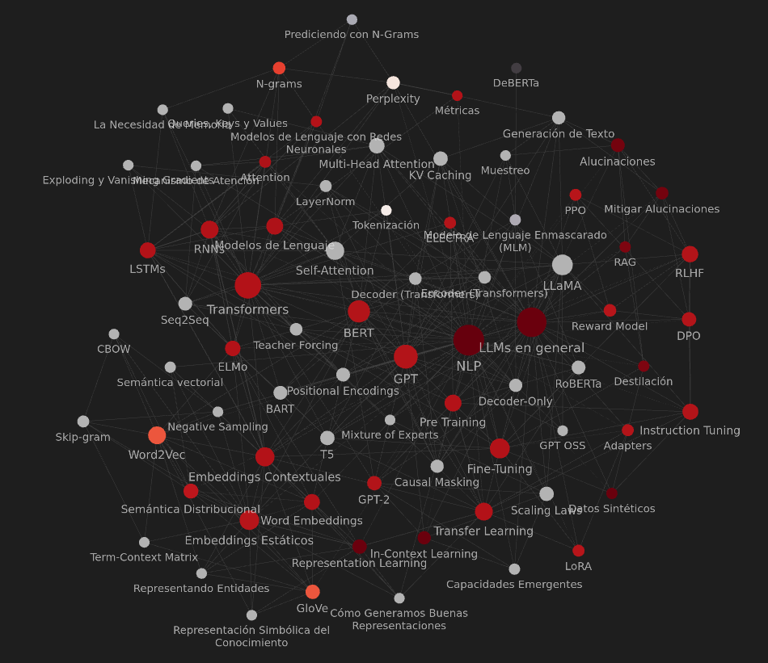

<p align="center">
  
</p>

# NLP Vault

An Obsidian knowledge base with 75 interconnected notes covering Natural Language Processing and Large Language Models — from foundational concepts to modern architectures.

## Contents

| Category | Topics |
|----------|--------|
| **Foundations** | Word Embeddings, N-grams, Tokenization, Perplexity, Metrics |
| **Static Embeddings** | Word2Vec (CBOW, Skip-gram), GloVe, Negative Sampling, Term-Context Matrix |
| **Language Models** | Neural Language Models, Representation Learning, Semantic Vectorization |
| **Sequential Models** | RNNs, LSTMs, Seq2Seq, Vanishing/Exploding Gradients |
| **Contextual Models** | ELMo, BERT, RoBERTa, ELECTRA, T5 |
| **Transformers** | Self-Attention, Multi-Head Attention, Positional Encodings, Causal Masking |
| **Modern Architectures** | GPT (1→4), LLaMA, Decoder-Only, Mixture of Experts |
| **Training & Alignment** | Pre-training, Fine-Tuning, Instruction Tuning, RLHF, DPO, LoRA |
| **Advanced Topics** | Scaling Laws, Emergent Abilities, In-Context Learning, Hallucinations, RAG, Synthetic Data |

## Structure

```
NLP/
├── NLP.md              # Main index with categorized navigation
├── *.md                # 75 concept notes with bidirectional links
├── attachments/        # 187 extracted study images
└── .obsidian/          # Obsidian workspace config + plugins
```

Each note includes:
- Frontmatter with tags and color coding
- Concept explanations in Spanish
- Related concept links via `[[wikilinks]]`
- Images from original study materials

## Tools

- **Extended Graph** — Enhanced graph view with clustering
- **BRAT** — Better reading annotation tool
- **Minimal theme** — Clean reading experience

## Built With

This vault was built with the help of a self-hosted **Qwen3-27B**, extracting content from a 131-section study document and organizing it into a navigable Obsidian knowledge graph.
